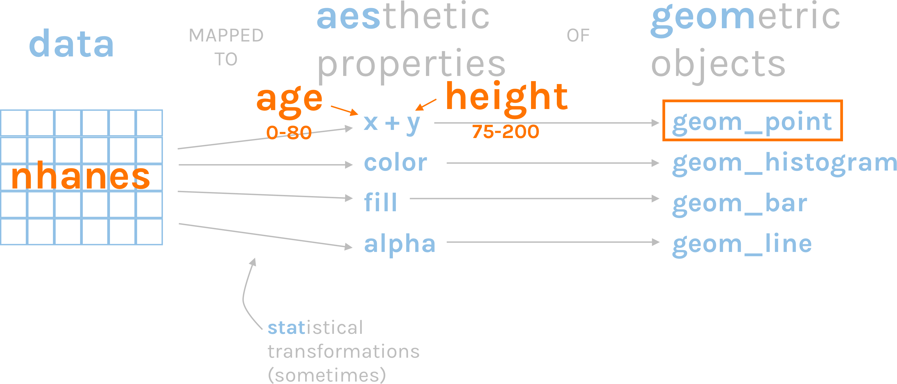
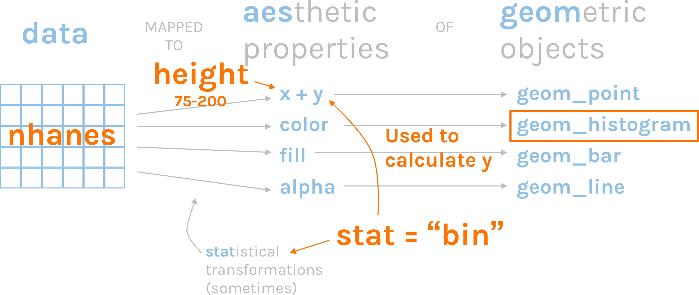
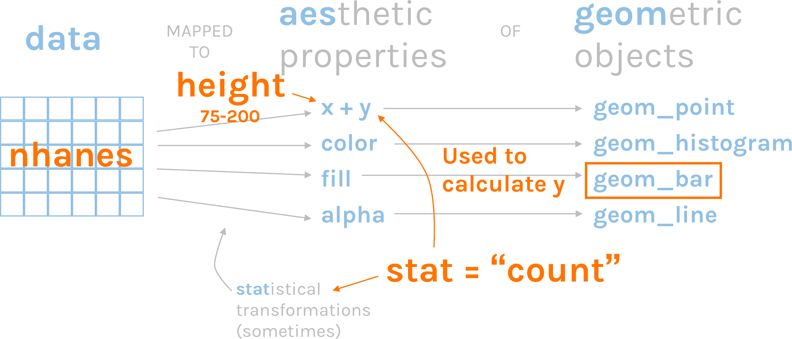
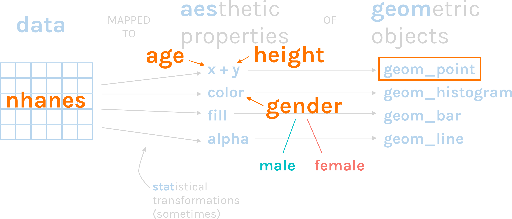

```{r setup, include=FALSE}
knitr::opts_chunk$set(echo = TRUE)
```

The examples are part of the Fundamentals of R course. For more, see the [R for the Rest of Us website](https://rfortherestofus.com/courses/fundamentals/).

# Grammar of Graphics

ggplot2 relies on the [grammar of graphics](https://vita.had.co.nz/papers/layered-grammar.pdf).


# Load Packages

Let's load the packages we need. These include `tidyverse` (especially the `dplyr` package) and `janitor`. 

```{r}
library(tidyverse)
library(janitor)
```

# Import NHANES Data

Let's import our data using `read_csv`. Note that the NHANES data is in the data directory so we need to include that.

```{r}
nhanes <- read_csv("data/nhanes.csv") %>%
  clean_names()
```


# Scatterplot

We use `geom_point` to make a scatterplot.

```{r}
ggplot(data = nhanes,
       mapping = aes(x = age,
                     y = height)) +
  geom_point()
```

Let's take a look at what's going on here.




# Histogram 

We use `geom_histogram` to make a histogram.

```{r}
ggplot(data = nhanes, 
       mapping = aes(x = height)) +
  geom_histogram()
```


How does ggplot know what to plot on the y axis? It's using the default statistical transformation for `geom_histogram`, which is `stat = "bin"`.




If we add `stat = "bin"` we get the same thing. Each geom has a default stat.

```{r}
ggplot(data = nhanes, 
       mapping = aes(x = height)) +
  geom_histogram(stat = "bin")
```

We can adjust the number of bins using the `bins` argument. 

```{r}
ggplot(data = nhanes, 
       mapping = aes(x = height)) +
  geom_histogram(bins = 100)
```


# Bar Chart

There are two basic approaches to making bar charts, both of which use `geom_bar`.

**Approach #1**

Use your full dataset.

Only assign a variable to the x axis.

Let ggplot use the default `stat` transformation (`stat = "count"`) to generate counts that it then plots on the y axis.

**Approach #2**

Wrangle your data frame before plotting, possibly creating a new data frame in the process

Assign variables to the x and y axes

Use `stat = "identity"` to tell ggplot to use the data exactly as it is


## Bar Chart v1


```{r}
ggplot(data = nhanes, 
       mapping = aes(x = height)) +
  geom_bar()
```


The default statistical transformation for `geom_bar` is `count`. This will give us the same result as our previous plot.

```{r}
ggplot(data = nhanes, 
       mapping = aes(x = height)) +
  geom_bar(stat = "count") 
```

Here's what's going on.




## Bar Chart v2

It's often easier to do our analysis work, save a data frame, and then use this to plot.

Let's recreate our `female_height_inches_by_age` data frame.

```{r}
female_height_inches_by_age <- nhanes %>% 
  filter(gender == "female") %>% 
  mutate(height_inches = height / 2.54) %>% 
  group_by(age_decade) %>% 
  summarize(height_inches = mean(height_inches,
                                 na.rm = TRUE)) %>% 
  drop_na(age_decade)
```

```{r}
female_height_inches_by_age
```


Then let's use this data frame to make a bar chart. The `stat = "identity"` here tells ggplot to use the exact data points without any `stat` transformations.

```{r}
ggplot(data = female_height_inches_by_age, 
       mapping = aes(x = age_decade, 
                     y = height_inches)) +
  geom_bar(stat = "identity") 
```


We can also flip the x and y axes using `coord_flip`. 

```{r}

ggplot(data = female_height_inches_by_age, 
       mapping = aes(x = age_decade, 
                     y = height_inches)) +
  geom_bar(stat = "identity") +
  coord_flip()

```


We can also `geom_col`, which uses `stat = "identity"` by default.

```{r}

ggplot(data = female_height_inches_by_age, 
       mapping = aes(x = age_decade, 
                     y = height_inches)) +
  geom_col() +
  coord_flip()

```


# `color` and `fill`

## color

We add the color argument *within* the `aes` so that the data in that variable is mapped to those aesthetic properties.

```{r}
ggplot(data = nhanes,
       mapping = aes(x = age,
                     y = height,
                     color = gender)) + 
  geom_point()
```

Note that each option in the gender variable (male and female) is mapped to a color (male = teal, female = red).



Let's try the same thing with a bar chart. 

```{r}
ggplot(data = female_height_inches_by_age, 
       mapping = aes(x = age_decade, 
                     y = height_inches,
                     color = age_decade)) +
  geom_bar(stat = "identity") 
```

That didn't work! Let's try `fill` instead.

```{r}
ggplot(data = female_height_inches_by_age, 
       mapping = aes(x = age_decade, 
                     y = height_inches,
                     fill = age_decade)) +
  geom_bar(stat = "identity") 
```

```{r}
ggplot(data = female_height_inches_by_age, 
       mapping = aes(x = age_decade, 
                     y = height_inches,
                     fill = age_decade)) +
  geom_bar(stat = "identity") 
```

# Scales


## color

We can change which colors the data is mapped to by using a `scale_` function. 

```{r}
ggplot(data = nhanes,
       mapping = aes(x = age,
                     y = height,
                     color = gender)) + 
  geom_point() +
  scale_color_manual(values = c("purple", "orange")) 
```

We can also use built-in palettes like `scale_color_viridis_d` (the d means it's for discrete data). 

```{r}
ggplot(data = nhanes,
       mapping = aes(x = age,
                     y = height,
                     color = gender)) + 
  geom_point() +
  scale_color_viridis_d(option = "plasma")
```

## x and y axes

Adjusting our x and y axes is similar. Remember that the x and y axes are considered an aesthetic properties in the same way color is.


We adjust our x and y axes using the `scale_` set of functions. Which exact function you use depends on your data. For example, you would use `scale_y_continuous` if you have continuous data on the y axis.

The `limits` argument sets the minimum and maximum values that display.

```{r}
ggplot(data = female_height_inches_by_age, 
       mapping = aes(x = age_decade, 
                     y = height_inches)) +
  geom_col() +
  scale_y_continuous(limits = c(0, 75))
```

The `breaks` argument determines which axis labels show up.

```{r}
ggplot(data = female_height_inches_by_age, 
       mapping = aes(x = age_decade, 
                     y = height_inches)) +
  geom_col() +
  scale_y_continuous(limits = c(0, 75),
                     breaks = c(0, 25, 50, 75))
```

If we want to change the x axis labels, we'd need to use `scale_x_discrete` because that data is categorical. I'm adding a `coord_flip` here to make it easier to read.

```{r}
ggplot(data = female_height_inches_by_age, 
       mapping = aes(x = age_decade, 
                     y = height_inches)) +
  geom_col() +
  scale_y_continuous(limits = c(0, 75),
                     breaks = c(0, 25, 50, 75)) +
  scale_x_discrete(labels = c("Zero to Nine", 
                              "Ten to Nineteen",
                              "Twenty to Twenty-Nine",
                              "Thirty to Thirty-Nine",
                              "Forty to Forty-Nine",
                              "Fifty to Fifty-Nine",
                              "Sixty to Sixty-Nine",
                              "Seventy to Seventy-Nine",
                              "Seventy and Above")) +
  coord_flip()
```

# Text and Labels

Text is just another geom. For example, we use `geom_text` to add labels to our figures.


```{r}
ggplot(data = female_height_inches_by_age, 
       mapping = aes(x = age_decade, 
                     y = height_inches)) +
  geom_bar(stat = "identity") +
  geom_text(aes(label = height_inches))
```

Let's add a new variable called `height_inches_one_digit` to use for plotting.

```{r}
female_height_inches_by_age <- female_height_inches_by_age %>% 
  mutate(height_inches_one_digit = round(height_inches, 1))
```


```{r}
ggplot(data = female_height_inches_by_age, 
       mapping = aes(x = age_decade, 
                     y = height_inches)) +
  geom_bar(stat = "identity") +
  geom_text(aes(label = height_inches_one_digit))
```

We can use the `hjust` and `vjust` argumments to horizontally and vertically adjust text.

`vjust = 0` puts the labels on the outer edge of the bars.

```{r}
ggplot(data = female_height_inches_by_age, 
       mapping = aes(x = age_decade, 
                     y = height_inches)) +
  geom_bar(stat = "identity") +
  geom_text(aes(label = height_inches_one_digit),
            vjust = 0)
```

`vjust = 1` puts the labels at the inner edge of the bars.

```{r}
ggplot(data = female_height_inches_by_age, 
       mapping = aes(x = age_decade, 
                     y = height_inches)) +
  geom_bar(stat = "identity") +
  geom_text(aes(label = height_inches_one_digit),
            hjust = 0) +
  coord_flip()
```

I often do something like `vjust = 1.5` to give a bit more padding. 

```{r}
ggplot(data = female_height_inches_by_age, 
       mapping = aes(x = age_decade, 
                     y = height_inches)) +
  geom_bar(stat = "identity") +
  geom_text(aes(label = height_inches_one_digit),
            vjust = 1.5)
```

We can adjust the color of the text using the `color` argument. We're putting it outside of the `aes` because we are setting it for the whole layer.

```{r}
ggplot(data = female_height_inches_by_age, 
       mapping = aes(x = age_decade, 
                     y = height_inches)) +
  geom_bar(stat = "identity") +
  geom_text(aes(label = height_inches_one_digit),
            vjust = 1.5,
            color = "white")
```

`geom_label` is nearly identical but it adds a background. With `geom_label` the `color` argument determines the text color while the fill is the background color.

```{r}
ggplot(data = female_height_inches_by_age, 
       mapping = aes(x = age_decade, 
                     y = height_inches)) +
  geom_bar(stat = "identity") +
  geom_label(aes(label = height_inches_one_digit),
             vjust = 1.5,
             fill = "white",
             color = "blue")
```


# Plot Labels

Let's start by making a slightly more complicated bar chart. We'll start by making a new data frame.

```{r}
height_inches_by_age <- nhanes %>% 
  mutate(height_inches = height / 2.54) %>% 
  group_by(age_decade, gender) %>% 
  summarize(height_inches = mean(height_inches,
                                 na.rm = TRUE)) %>% 
  drop_na(age_decade)
```

Then let's take a look at our new data frame.

```{r}
height_inches_by_age
```

Now let's plot this data frame using a bar chart.

```{r}
ggplot(data = height_inches_by_age, 
       mapping = aes(x = age_decade, 
                     y = height_inches,
                     fill = gender)) +
  geom_col() 
```

The bars are stacked by default. To put them side by side, we use the `position = "dodge"` argument within the `geom_col`.

```{r}
ggplot(data = height_inches_by_age, 
       mapping = aes(x = age_decade, 
                     y = height_inches,
                     fill = gender)) +
  geom_col(position = "dodge") 
```

To add labels to our plot, we use `labs`.

We can a title to the plot with the `title` argument.

```{r}
ggplot(data = height_inches_by_age, 
       mapping = aes(x = age_decade, 
                     y = height_inches,
                     fill = gender)) +
  geom_col(position = "dodge") +
  scale_y_continuous(limits = c(0, 75),
                     breaks = c(0, 25, 50, 75)) +
  labs(title = "Males are taller than females at almost all ages") 
```

We can add a `subtitle` as well.

```{r}
ggplot(data = height_inches_by_age, 
       mapping = aes(x = age_decade, 
                     y = height_inches,
                     fill = gender)) +
  geom_col(position = "dodge") +
  scale_y_continuous(limits = c(0, 75),
                     breaks = c(0, 25, 50, 75)) +
  labs(title = "Males are taller than females at almost all ages",
       subtitle = "But not at 0-9")
```


We can change the x and y axis labels using the `x` and `y` arguments.

```{r}
ggplot(data = height_inches_by_age, 
       mapping = aes(x = age_decade, 
                     y = height_inches,
                     fill = gender)) +
  geom_col(position = "dodge") +
  scale_y_continuous(limits = c(0, 75),
                     breaks = c(0, 25, 50, 75)) +
  labs(title = "Males are taller than females at almost all ages",
       subtitle = "But not at 0-9",
       x = "Age",
       y = "Height in Inches")
```

To change the title above the legend, we use the name of the aesthetic that is being shown.

```{r}
ggplot(data = height_inches_by_age, 
       mapping = aes(x = age_decade, 
                     y = height_inches,
                     fill = gender)) +
  geom_col(position = "dodge") +
  scale_y_continuous(limits = c(0, 75),
                     breaks = c(0, 25, 50, 75)) +
  labs(title = "Males are taller than females at almost all ages",
       subtitle = "But not at 0-9",
       x = "Age",
       y = "Height in Inches",
       fill = "")
```

# Themes

To add a theme to a plot, we use the `theme_` set of functions. There are several built-in themes. For instance, `theme_minimal`.

```{r}
ggplot(data = height_inches_by_age, 
       mapping = aes(x = age_decade, 
                     y = height_inches,
                     fill = gender)) +
  geom_col(position = "dodge") +
  scale_y_continuous(limits = c(0, 75),
                     breaks = c(0, 25, 50, 75)) +
  labs(title = "Males are taller than females at almost all ages",
       subtitle = "But not at 0-9",
       x = "Age",
       y = "Height in Inches",
       fill = "") +
  theme_minimal() 
```

There's also `theme_light`.

```{r}
ggplot(data = height_inches_by_age, 
       mapping = aes(x = age_decade, 
                     y = height_inches,
                     fill = gender)) +
  geom_col(position = "dodge") +
  scale_y_continuous(limits = c(0, 75),
                     breaks = c(0, 25, 50, 75)) +
  labs(title = "Males are taller than females at almost all ages",
       subtitle = "But not at 0-9",
       x = "Age",
       y = "Height in Inches",
       fill = "") +
  theme_light()
```

There are also packages that give you themes you can apply to your plots. 

Let's load the `ggthemes` package (install it if necessary).

```{r}
# install.packages("ggthemes")
library(ggthemes)
```

We can then use a theme from this package (`theme_economist`) to make our plots look like those in the Economist.

```{r}
ggplot(data = height_inches_by_age, 
       mapping = aes(x = age_decade, 
                     y = height_inches,
                     fill = gender)) +
  geom_col(position = "dodge") +
  scale_y_continuous(limits = c(0, 75),
                     breaks = c(0, 25, 50, 75)) +
  labs(title = "Males are taller than females at almost all ages",
       subtitle = "But not at 0-9",
       x = "Age",
       y = "Height in Inches",
       fill = "") +
  theme_economist()
```


Another option is `theme_gdocs()`, which makes your plots look like those made in Google Sheets.

```{r}
ggplot(data = height_inches_by_age, 
       mapping = aes(x = age_decade, 
                     y = height_inches,
                     fill = gender)) +
  geom_col(position = "dodge") +
  scale_y_continuous(limits = c(0, 75),
                     breaks = c(0, 25, 50, 75)) +
  labs(title = "Males are taller than females at almost all ages",
       subtitle = "But not at 0-9",
       x = "Age",
       y = "Height in Inches",
       fill = "") +
  theme_gdocs() 
```


# Facets

One of the most powerful features of ggplot is facetting. You can make small multiples by adding just a line of code using the `facet_wrap` function. 

```{r}
ggplot(data = height_inches_by_age, 
       mapping = aes(x = age_decade, 
                     y = height_inches,
                     fill = gender)) +
  geom_col(position = "dodge") +
  scale_y_continuous(limits = c(0, 75),
                     breaks = c(0, 25, 50, 75)) +
  labs(title = "Males are taller than females at almost all ages",
       subtitle = "But not at 0-9",
       x = "Age",
       y = "Height in Inches",
       fill = "") +
  theme_economist() +
  facet_wrap(~gender)
```

Let's drop the legend since it's redundant at this point. We do this by adding the `show.legend = FALSE` argument within `geom_col`.

```{r}
ggplot(data = height_inches_by_age, 
       mapping = aes(x = age_decade, 
                     y = height_inches,
                     fill = gender)) +
  geom_col(position = "dodge",
           show.legend = FALSE) +
  scale_y_continuous(limits = c(0, 75),
                     breaks = c(0, 25, 50, 75)) +
  labs(title = "Males are taller than females at almost all ages",
       subtitle = "But not at 0-9",
       x = "Age",
       y = "Height in Inches",
       fill = "") +
  theme_economist() +
  facet_wrap(~gender)
```


We can do this for any type of figure. Recall our scatterplot from before (with a nice theme added).

```{r}
ggplot(data = nhanes,
       mapping = aes(x = age,
                     y = height,
                     color = gender)) +
  geom_point() +
  theme_economist() +
  facet_wrap(~gender)
```


Or our histogram.


```{r}
ggplot(data = nhanes, 
       mapping = aes(x = height,
                     fill = gender)) +
  geom_histogram() +
  theme_economist() +
  facet_wrap(~gender)
```

You can use `facet_wrap` for as many groups as you have in your data.

```{r}
ggplot(data = nhanes,
       mapping = aes(x = age,
                     y = bmi)) +
  geom_point() +
  theme_economist() +
  facet_wrap(~education)
```

# Save Plots

There are two ways to think about saving your plots. 

If you're working in RMarkdown, just knit your file and your plots will show up as part of your HTML, Word, or PDF document. Use this option by default!

If you do need to save an individual plot for some other purpose (e.g. putting it in a report not created in RMarkdown), use the `ggsave` function. By default, `ggsave` will save the last plot you made.

First, we plot.

```{r}
ggplot(data = height_inches_by_age, 
       mapping = aes(x = age_decade, 
                     y = height_inches,
                     fill = gender)) +
  geom_col(position = "dodge",
           show.legend = FALSE) +
  scale_y_continuous(limits = c(0, 70),
                     breaks = c(0, 10, 20, 30, 40, 50, 60, 70)) +
  labs(title = "Males are taller than females at almost all ages",
       subtitle = "But not at 0-9",
       x = "Age",
       y = "Height in Inches",
       fill = "") +
  theme_economist() +
  facet_wrap(~gender)
```

And then we save this plot.

```{r}
ggsave(filename = "plots/age-height.png",
       height = 8,
       width = 11,
       units = "in",
       dpi = 300)
```

We can save our plot to other formats as well. PDF is a great option because it produces small file sizes and high-quality plots. You don't need to list dpi here as PDFs are [vector based](https://www.stickermule.com/blog/raster-vs-vector-images).

```{r}
ggsave(filename = "plots/age-height.pdf",
       height = 8,
       width = 11)
```


