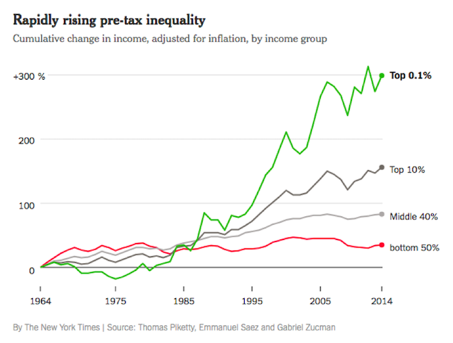
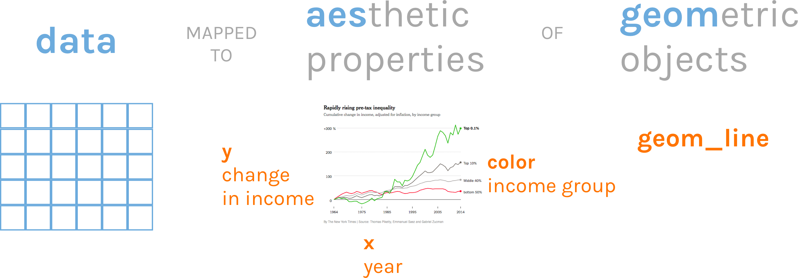

```{r setup, include=FALSE}
knitr::opts_chunk$set(eval = F, 
                      warning = F,
                      message = F,
                      dpi = 300)

library(tidyverse)
library(skimr)
library(janitor)
library(here)


```

```{r include = F, eval = T}

# This is just because the presentation file is in a subdirectory so need to actually load it but don't want to confuse folks.

nhanes <- read_csv(here("data/nhanes.csv")) %>% 
  clean_names()

```


# An Important Workflow Tip


---

class: inverse, center, middle, dk-section-title

# Grammar of Graphics

---

## Grammar of Graphics


<!-- --- -->

<!-- class: middle -->

<!-- <p style="font-size: 150%";> -->
<!-- The grammar of graphics is based on the insight that you can uniquely describe <i>any</i> plot as a combination of a dataset, a geom, a set of mappings, a stat, a position adjustment, a coordinate system, and a faceting scheme. -->
<!-- </p> -->

<!-- &mdash; Garrett Grolemund and Hadley Wickham in [R for Data Science](https://r4ds.had.co.nz/data-visualisation.html#the-layered-grammar-of-graphics) -->


---

class: middle, center



---

class: middle, center



---

# ggplot2

.pull-left[
```{r}
ggplot(data = inequality_data,
       mapping = aes(x = year,
                     y = income_change,
                     color = group)) +
  geom_line()
```
]
.pull-right[

]

--

*Note: `ggplot` uses the + where `tidyverse` uses the pipe. Make sure you don't flip the two.*

---

class: inverse, center, middle, dk-section-title

The remainder of this section of the course does not use slides. 

See instead [this RMarkdown document](https://github.com/rfortherestofus/fundamentals/blob/master/data-visualization-examples.Rmd) with examples.
