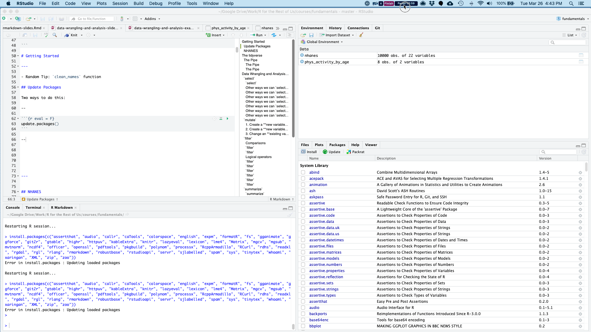
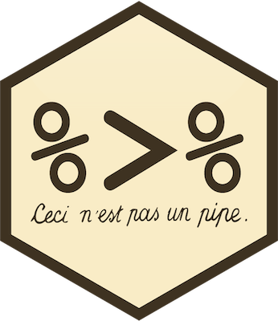
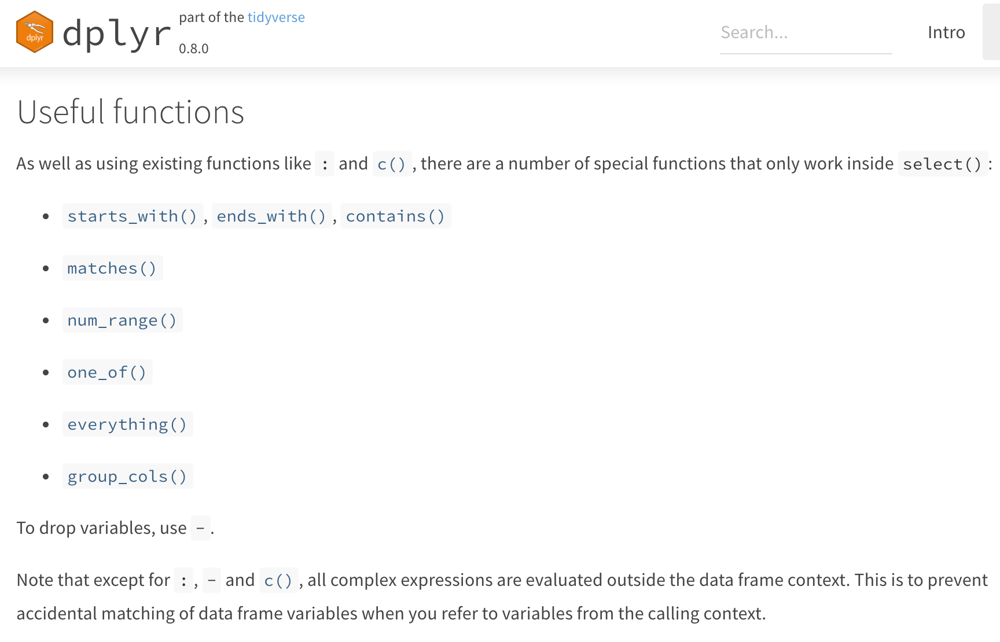

```{r setup, include=FALSE}
knitr::opts_chunk$set(eval = F, 
                      warning = F,
                      message = F)

library(tidyverse)
library(skimr)
library(janitor)
library(here)
library(kableExtra)


```


```{r include = F, eval = T}

# This is just because the presentation file is in a subdirectory so need to actually load it but don't want to confuse folks.

nhanes <- read_csv(here("data/nhanes.csv")) %>% 
  clean_names()

```


class: inverse, center, middle, dk-section-title

## Update Packages

---

## Update Packages




---


## NHANES

.pull-left[
*"The National Health and Nutrition Examination Survey (NHANES) is a program of studies designed to assess the health and nutritional status of adults and children in the United States. The survey is unique in that it combines interviews and physical examinations."*
]

.pull-right[

]

???

Website: https://www.cdc.gov/nchs/nhanes/index.htm

Video: https://www.youtube.com/watch?v=GmnN2r5J0YA

R package: https://cran.r-project.org/web/packages/NHANES/index.html


---

class: inverse, center, middle, dk-section-title

# The tidyverse

---

## Base R Syntax


--

```{r}
table(nhanes$education,
      nhanes$phys_active)
```

--

- Starts with function, data frame in parentheses

--

- Uses dollar sign notation (data_frame$variable)

--

- Requires repeating data frame name each time you call it

---


## Tidyverse Syntax


```{r}
nhanes %>% 
  tabyl(education, phys_active)

```

--

- "data frame first, data frame once" - [Alison Hill](https://ohsu-conj620.netlify.com/slides/cm012.html#20)

--

- Uses the pipe (%>%) to chain together a series of functions


---

class: center, middle

## The pipe



---

### The pipe

Using the pipe, we can start with a data frame and then conduct a series of functions all at once. Read each pipe as "then."

```{r}
nhanes %>% 
  filter(survey_yr == "2009_10") %>% 
  group_by(education) %>% 
  summarize(mean_bmi = mean(bmi, na.rm = TRUE))

```

--

*Keyboard shortcut to add a pipe: command-shift-M (Mac) or control-shift-M (Windows).*


---

class: inverse, dk-section-title

### A pipe example (that's also a great tip!)

Make your variables easy to work with using the `clean_names` function in the `janitor` package.

---

class:inverse

### Your Turn

Download the course project:


```{r}
install.packages("usethis")
library(usethis)
use_course("http://bit.ly/fundamentals-of-r-course")
```


---

class:inverse

### Your Turn


1. Open the data-wrangling-and-analysis-exercises.Rmd file

--

1. Load packages

--

1. Import NHANES data and use the `clean_names` function on it


---

## Data Wrangling and Analysis Verbs


---

class: inverse, center, middle, dk-section-title

The remainder of this section of the course does not use slides. 

See instead [this RMarkdown document](https://github.com/rfortherestofus/fundamentals/blob/master/data-wrangling-and-analysis-examples.Rmd) with examples.

<!-- ## `select` -->

<!-- Choose variables from the larger data frame -->

<!--  -->

<!-- --- -->

<!-- ### `select` -->

<!-- ```{r eval = T} -->
<!-- nhanes %>% -->
<!--   select(age) -->
<!-- ``` -->


<!-- --- -->

<!-- ### Other ways we can `select` variables -->

<!-- Select multiple variables by listing them: -->

<!-- ```{r eval = T} -->
<!-- nhanes %>% -->
<!--   select(height, weight) -->
<!-- ``` -->

<!-- --- -->

<!-- ### Other ways we can `select` variables -->

<!-- You can use `one_of()` to do the same thing: -->

<!-- ```{r eval = T} -->
<!-- nhanes %>% -->
<!--   select(one_of(c("height", "weight"))) -->
<!-- ``` -->

<!-- --- -->

<!-- ### Other ways we can `select` variables -->

<!-- `contain()` selects variable with certain text in the variable name: -->


<!-- ```{r eval = T} -->
<!-- nhanes %>% -->
<!--   select(contains("age")) -->
<!-- ``` -->

<!-- --- -->

<!-- ### Other ways we can `select` variables -->

<!-- You can select a range of columns using the var1:var2 pattern -->


<!-- ```{r eval = T} -->
<!-- nhanes %>% -->
<!--   select(weight:bmi) -->
<!-- ``` -->

<!-- --- -->

<!-- ### Other ways we can `select` variables -->

<!-- Drop variables using the -var format: -->


<!-- ```{r eval = T} -->
<!-- nhanes %>% -->
<!--   select(-id) -->
<!-- ``` -->

<!-- --- -->

<!-- ### Other ways we can `select` variables -->

<!-- Drop a set of variables using the -(var1:var2) format: -->


<!-- ```{r eval = T} -->
<!-- nhanes %>% -->
<!--   select(-(id:education)) -->
<!-- ``` -->


<!-- --- -->

<!-- ### Other ways we can `select` variables -->

<!-- There are other ways to select variables. See the [`dplyr` website](https://dplyr.tidyverse.org/reference/select.html). -->

<!--  -->


<!-- --- -->


<!-- ## `mutate` -->

<!-- .pull-left[ -->
<!-- Create new variables or recode existing ones -->
<!-- ] -->

<!-- .pull-right[ -->
<!--  -->
<!-- ] -->

<!-- You can use `mutate` in three ways. -->


<!-- --- -->

<!-- ### 1. Create a **new variable with a specific value** -->

<!-- ```{r eval = T} -->
<!-- nhanes %>% -->
<!--   mutate(country = "United States") %>% -->
<!--   select(country) -->
<!-- ``` -->


<!-- --- -->

<!-- ### 2. Create a **new variable based on other variables** -->

<!-- ```{r eval = T} -->
<!-- nhanes %>% -->
<!--   mutate(height_inches = height / 2.54) %>% -->
<!--   select(contains("height")) -->
<!-- ``` -->


<!-- --- -->

<!-- ### 3. Change an **existing variable** -->

<!-- ```{r eval = T} -->
<!-- nhanes %>% -->
<!--   mutate(bmi = round(bmi, digits = 1)) %>% -->
<!--   select(bmi) -->
<!-- ``` -->

<!-- --- -->

<!-- ## `filter` -->

<!-- .pull-left[ -->
<!-- Choose a subset of cases. -->
<!-- ] -->

<!-- .pull-right[ -->
<!--  -->
<!-- ] -->


<!-- --- -->

<!-- ### Comparisons -->

<!-- ```{r include = FALSE, eval = T} -->

<!-- comp_table <- tibble::tribble( -->
<!--   ~Operator, ~Description, ~Usage, -->
<!--   "<", "less than", "x < y", -->
<!--   "<=", "less than or equal to", "x <= y", -->
<!--   ">", "greater than", "x > y", -->
<!--   ">=", "greater than or equal to", "x >= y", -->
<!--   "==", "exactly equal to", "x == y", -->
<!--   "!=", "not equal to", "x != y", -->
<!--   "%in%", "group membership", "x %in% y", -->
<!--   "is.na", "is missing", "is.na(x)", -->
<!--   "!is.na", "is not missing", "!is.na(x)" -->
<!-- ) -->
<!-- ``` -->

<!-- ```{r eval = T, echo = F} -->
<!-- comp_table %>% -->
<!--   kable() %>% -->
<!--   kable_styling(bootstrap_options = c("striped", "hover", "compact")) -->
<!-- ``` -->


<!-- --- -->

<!-- ### `filter` -->

<!-- ```{r eval = T} -->
<!-- nhanes %>% -->
<!--   filter(gender == "female") %>% #<< -->
<!--   select(gender) -->
<!-- ``` -->


<!-- --- -->

<!-- ### `filter` -->

<!-- ```{r eval = T} -->
<!-- nhanes %>% -->
<!--   filter(health_gen != "Good") %>% #<< -->
<!--   select(health_gen) -->
<!-- ``` -->


<!-- --- -->


<!-- ### Logical operators -->

<!-- With logical operators, we can create complex filters (e.g. keep only those who say their health is "good", "very good", or "excellent"). -->

<!-- ```{r include = FALSE, eval = T} -->
<!-- logic_table <- tibble::tribble( -->
<!--   ~Operator, ~Description, ~Usage, -->
<!--   "&", "and", "x & y", -->
<!--   "|", "or", "x | y", -->
<!--   # "xor", "exactly x or y", "xor(x, y)", -->
<!--   "!", "not", "!x" -->
<!-- ) -->

<!-- ``` -->

<!-- ```{r eval = T, echo = F} -->
<!-- logic_table %>% -->
<!--   kable() %>% -->
<!--   kable_styling(bootstrap_options = c("striped", "hover")) -->

<!-- ``` -->

<!-- --- -->

<!-- ### `filter` -->

<!-- ```{r eval = T} -->
<!-- nhanes %>% -->
<!--   filter(health_gen != "Good" | health_gen != "VGood" | health_gen != "Excellent") %>% #<< -->
<!--   select(health_gen) -->
<!-- ``` -->


<!-- --- -->

<!-- ### `filter` -->

<!-- ```{r eval = T} -->
<!-- nhanes %>% -->
<!--   filter(health_gen %in% c("Good", "VGood", "Excellent")) %>% #<< -->
<!--   select(health_gen) -->
<!-- ``` -->


<!-- --- -->

<!-- ### `filter` -->

<!-- You can chain together multiple `filter` functions. Doing it this way, we don't have create complex logic in one line. -->

<!-- ```{r eval = F} -->
<!-- nhanes %>% -->
<!--   filter(gender == "male" & health_gen %in% c("Good", "VGood", "Excellent")) %>% #<< -->
<!--   select(gender, health_gen) -->
<!-- ``` -->


<!-- -- -->

<!-- ```{r eval = F} -->
<!-- nhanes %>% -->
<!--   filter(gender == "male") %>% #<< -->
<!--   filter(health_gen %in% c("Good", "VGood", "Excellent")) %>% #<< -->
<!--   select(gender, health_gen) -->
<!-- ``` -->


<!-- --- -->

<!-- ### `filter` -->

<!-- Use <, >, <=, and => for numeric data. -->

<!-- ```{r eval = T} -->
<!-- nhanes %>% -->
<!--   filter(age > 50) %>% #<< -->
<!--   select(age) -->
<!-- ``` -->

<!-- --- -->


<!-- ### `filter` -->

<!-- You can drop `NAs` with `!is.na()` -->

<!-- ```{r eval = T} -->
<!-- nhanes %>% -->
<!--   filter(age > 50) %>% -->
<!--   filter(!is.na(marital_status)) %>% #<< -->
<!--   select(age, marital_status) -->
<!-- ``` -->


<!-- --- -->


<!-- ### `filter` -->

<!-- You can also drop `NAs` with `drop_na()` -->

<!-- ```{r eval = T} -->
<!-- nhanes %>% -->
<!--   filter(age > 50) %>% -->
<!--   drop_na(marital_status) %>% #<< -->
<!--   select(age, marital_status) -->
<!-- ``` -->

<!-- --- -->

<!-- ## `summarize` -->

<!-- .pull-left[ -->
<!-- Go from a complete dataset down to a summary. -->
<!-- ] -->

<!-- .pull-right[ -->
<!--  -->
<!-- ] -->

<!-- --- -->

<!-- ### `summarize` -->

<!-- ```{r eval = T} -->
<!-- nhanes %>% -->
<!--   summarize(mean_active_days = mean(phys_active_days)) -->
<!-- ``` -->


<!-- --- -->

<!-- ### `summarize` -->


<!-- ```{r eval = T} -->
<!-- nhanes %>% -->
<!--   summarize(mean_active_days = mean(phys_active_days, -->
<!--                                     na.rm = TRUE)) #<< -->
<!-- ``` -->

<!-- --- -->

<!-- ### `summarize` math functions -->

<!-- ```{r include = FALSE, eval = T} -->
<!-- summary_table <- tibble::tribble( -->
<!--   ~Description, ~Usage, -->
<!--   "number", "n()", -->
<!--   "sum", "sum(x)", -->
<!--   "minimum", "min(x)", -->
<!--   "maximum", "max(x)", -->
<!--   "mean", "mean(x)", -->
<!--   "median", "mean(x)", -->
<!--   "standard deviation", "sd(x)", -->
<!--   "variance", "var(x)", -->
<!--   "rank", "rank(x)" -->
<!-- ) -->
<!-- ``` -->


<!-- ```{r eval = T, echo = F} -->
<!-- summary_table %>% -->
<!--   kable() %>% -->
<!--   kable_styling(bootstrap_options = c("striped", "hover")) -->

<!-- ``` -->

<!-- See the [Base R cheatsheet](https://github.com/rstudio/cheatsheets/blob/master/base-r.pdf) for more. -->

<!-- --- -->

<!-- ### `summarize` -->


<!-- You can have multiple arguments in each usage of `summarize`. -->

<!-- ```{r eval = T} -->
<!-- nhanes %>% -->
<!--   summarize(mean_active_days = mean(phys_active_days, na.rm = TRUE), -->
<!--             median_active_days = median(phys_active_days, na.rm = TRUE), #<< -->
<!--             number_of_responses = n()) #<< -->
<!-- ``` -->

<!-- --- -->


<!-- ## `group_by` -->

<!-- .pull-left[ -->
<!-- `summarize` becomes truly powerful when paired with `group_by` -->
<!-- ] -->

<!-- .pull-right[ -->
<!--  -->
<!-- ] -->


<!-- --- -->

<!-- ### `group_by` -->

<!-- ```{r eval = T} -->
<!-- nhanes %>% -->
<!--   group_by(age_decade) %>% #<< -->
<!--   summarize(mean_active_days = mean(phys_active_days, -->
<!--                                     na.rm = TRUE)) -->
<!-- ``` -->


<!-- --- -->

<!-- ### `group_by` example -->

<!-- `group_by` works for multiple groups. -->

<!-- ```{r eval = T} -->
<!-- nhanes %>% -->
<!--   group_by(age_decade, gender) %>% #<< -->
<!--   summarize(mean_active_days = mean(phys_active_days, -->
<!--                                     na.rm = TRUE)) -->
<!-- ``` -->


<!-- --- -->

<!-- ### `count` -->

<!-- If you just want to count the number of things per group, you can use `count`. -->


<!-- ```{r eval = T} -->
<!-- nhanes %>% -->
<!--   count(age_decade) -->
<!-- ``` -->


<!-- --- -->

<!-- ### `count` -->

<!-- You can also count by multiple groups. -->

<!-- ```{r eval = T} -->
<!-- nhanes %>% -->
<!--   count(age_decade, gender) -->
<!-- ``` -->


<!-- --- -->


<!-- ## `arrange` -->

<!-- .pull-left[ -->
<!-- Reorder rows in a data frame based on the values of one or more variables -->
<!-- ] -->

<!-- .pull-right[ -->
<!--  -->
<!-- ] -->

<!-- --- -->


<!-- ### `arrange` example -->

<!-- R arranges in ascending order by default -->

<!-- ```{r eval = T} -->
<!-- nhanes %>% -->
<!--   group_by(age_decade, gender) %>% #<< -->
<!--   summarize(mean_active_days = mean(phys_active_days, -->
<!--                                     na.rm = TRUE)) %>% -->
<!--   arrange(mean_active_days) -->
<!-- ``` -->

<!-- --- -->

<!-- ### `arrange` example -->

<!-- You can also arrange in descending order -->


<!-- ```{r eval = T} -->
<!-- nhanes %>% -->
<!--   group_by(age_decade, gender) %>% #<< -->
<!--   summarize(mean_active_days = mean(phys_active_days, -->
<!--                                     na.rm = TRUE)) %>% -->
<!--   arrange(desc(mean_active_days)) -->
<!-- ``` -->

<!-- --- -->

<!-- ## Crosstabs -->

<!-- Sometimes you want your results in a crosstab. We'll use the `tabyl` function in `janitor` package to make crosstabs automatically. -->

<!-- -- -->

<!-- ```{r eval = T} -->
<!-- nhanes %>% -->
<!--   tabyl(gender, age_decade) -->
<!-- ``` -->

<!-- --- -->

<!-- ### `adorn_` functions -->

<!-- `janitor` has a set of functions that all start with `adorn_` that add a number of things to our crosstabs. You call them after `tabyl`. -->

<!-- --- -->

<!-- ### Add totals -->

<!-- ```{r eval = T} -->

<!-- nhanes %>% -->
<!--   tabyl(gender, age_decade) %>% -->
<!--   adorn_totals(c("row", "col")) #<< -->


<!-- ``` -->


<!-- --- -->

<!-- ### Add percentages -->


<!-- ```{r eval = T} -->
<!-- nhanes %>% -->
<!--   tabyl(gender, age_decade) %>% -->
<!--   adorn_totals(c("row", "col")) %>% -->
<!--   adorn_percentages() #<< -->
<!-- ``` -->

<!-- --- -->

<!-- ### Format percentages -->

<!-- ```{r eval = T} -->
<!-- nhanes %>% -->
<!--   tabyl(gender, age_decade) %>% -->
<!--   adorn_totals(c("row", "col")) %>% -->
<!--   adorn_percentages() %>% -->
<!--   adorn_pct_formatting()  #<< -->
<!-- ``` -->


<!-- --- -->

<!-- ### Include n alongside percentages -->

<!-- ```{r eval = T} -->
<!-- nhanes %>% -->
<!--   tabyl(gender, age_decade) %>% -->
<!--   adorn_totals(c("row", "col")) %>% -->
<!--   adorn_percentages() %>% -->
<!--   adorn_pct_formatting() %>% -->
<!--   adorn_ns() #<< -->
<!-- ``` -->


<!-- --- -->

<!-- ### Add title -->

<!-- ```{r eval = T} -->
<!-- nhanes %>% -->
<!--   tabyl(gender, age_decade) %>% -->
<!--   adorn_totals(c("row", "col")) %>% -->
<!--   adorn_percentages() %>% -->
<!--   adorn_pct_formatting() %>% -->
<!--   adorn_ns() %>% -->
<!--   adorn_title() #<< -->
<!-- ``` -->

<!-- --- -->


<!-- ### Three (or more) way crosstabs -->

<!-- You can also do three (or more) way crosstabs automatically by adding more variables to the `tabyl` function. -->

<!-- ```{r eval = T} -->
<!-- nhanes %>% -->
<!--   tabyl(gender, age_decade, education) %>% #<< -->
<!--   adorn_totals(c("row", "col")) %>% -->
<!--   adorn_percentages() %>% -->
<!--   adorn_pct_formatting() %>% -->
<!--   adorn_ns() %>% -->
<!--   adorn_title() -->

<!-- ``` -->


<!-- --- -->

<!-- # Create new data frames -->

<!-- Sometimes you want to save the results of your work to a new data frame. -->

<!-- ```{r} -->
<!-- phys_activity_by_age <- nhanes %>% -->
<!--   group_by(age_decade) %>% #<< -->
<!--   summarize(mean_active_days = mean(phys_active_days, -->
<!--                                     na.rm = TRUE)) %>% -->
<!--   drop_na() -->
<!-- ``` -->

