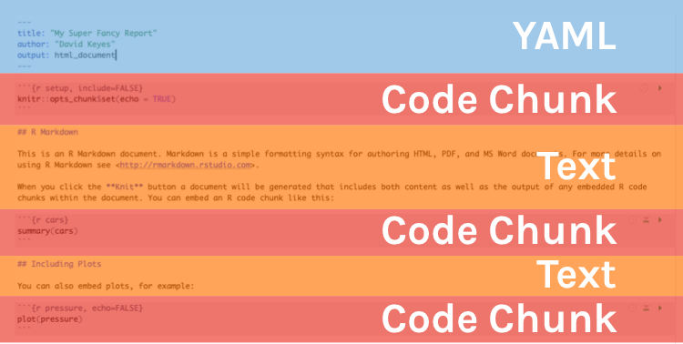
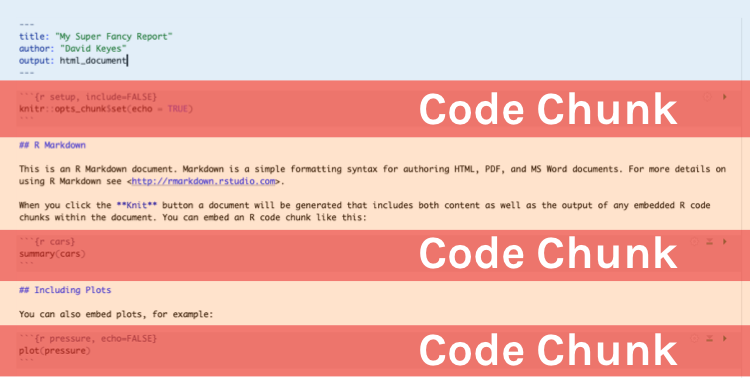
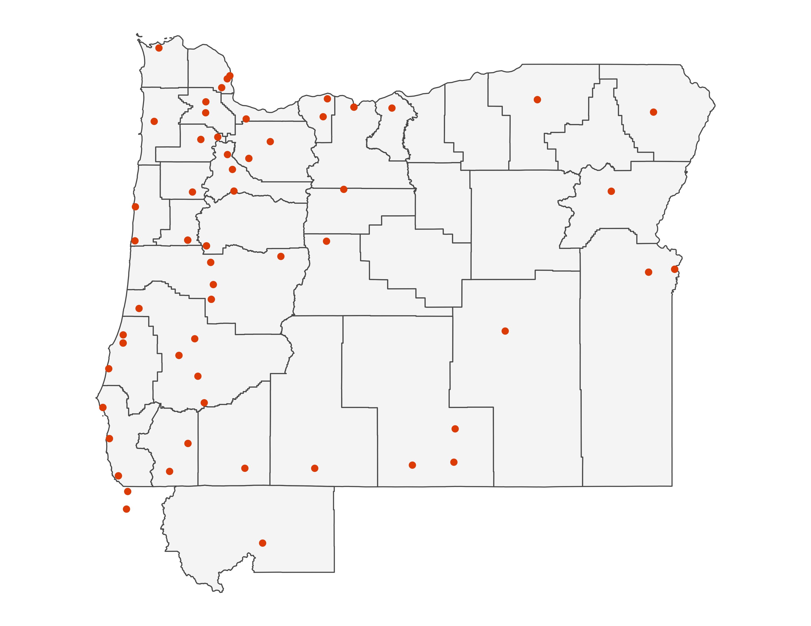

```{r child = "setup.Rmd"}
```

# Start with Story

# Why Use RMarkdown?

You can combine code and writing in one document (i.e no copying into Excel to make figures). 

--

You write it in a simple way (using Markdown syntax) so that you can compile it into multiple formats

--

You then run your analyses and get a report spit out in Word, PDF, or HTML format (and many others as well). 

--

Added bonus: no potential for copy and paste errors!


---


# RMarkdown Document Overview

Every RMarkdown document has the following:

1. **YAML** (one per document)

2. **Markdown text** (repeated as many times as necessary)

3. **Code chunks** (repeated as many times as necessary)


---

## RMarkdown Document Overview



---

## YAML

Stands for "YAML Ain't Markup Language" (don't worry about it).

--

Often referred to as "R Markdown front matter."

--

It is metadata that tells RMarkdown things like title, author, date, output options, etc. 

--

```{r}
---
title: "My Super Fancy Report"
author: "David Keyes"
output: html_document
---
```

---

## Markdown Text


.pull-left[
**Markdown**

```
Text with **some words in bold** 
and *some words in italics*


# Header

## Subheader

### Third-Level Subheader


- Bulleted list
    - Sublist


1. Numbered
2. List
```
]

.pull-right[
**Output**

Text with **some words in bold** and *some words in italics*

### Header
#### Subheader

- Bulleted list
    - Sublist

1. Numbered
2. List

]


---


# Code Chunks

RMarkdown can also execute the code and then display the result. They start with three backticks and {r} and end with three backticks. 

*Keyboard shortcut to add a code chunk: command-option-I (Mac).*


.pull-left[
**Code Chunk**



]
.pull-right[
**Output**


]


---


## Setup Code Chunk

A special code chunk with the text `setup` right after the `r`. 

It sets defaults for the entire document. You can change this for each code chunk.


---

## Chunk Options

Two most important ones:

`echo`: Do you want to show the R code in the final report?

--

`include`: Do you want to include the output (i.e. the graph or table) that the code produces?

--


There are a lot more options that we won't discuss today: 

- `warning` (show any warnings that R throws)
- `message` (show any messages that R sends)
- `fig.width` (default figure width)
- `fig.height` (default figure height), etc. 


---


## An important note

You must do all the work with your data in the same RMarkdown file that you use to create your report. 

--

If you have imported data using an R script, it will not work in RMarkdown unless you import that same data **within your RMarkdown file**. 

--

Just because it shows in the environment pane, doesn't mean you can use it!


---


# Output Formats

Lots of options, with Word, PDF, and HTML the most common. 

--

We recommend you start with HTML because it allows you to do things like have a clickable table of contents, paged results tables, interactive figures, see your code, and more (you can switch to another format at any point). 


---


## Changing Output Format

You can use the dropdown next to the knit button to change the output format. You can even knit to multiple formats at the same time!


---

# Render Your File


---


class:inverse

## Your Task

1. Create a new RMarkdown file.

2. Knit your file and open it.

3. Add a new header somewhere in the file that says: "*Hipster Ipsum*"

4. Add the following text somewhere in the file: "*Lorem ipsum dolor amet occupy 90's kinfolk man*"

5. Change the default in the setup chunk so that code does not show in the knitted report.

6. Change the output format so that your file knits to Word in addition to HTML.

7. Use the knit button to render your RMarkdown file again, making sure you get both HTML and Word files. 
8. Compare the knitted HTML file you have now to the version you got in step 2.


